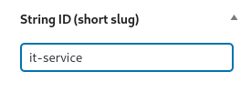

# String id (symbolic id) functionality for WordPress posts



## Is provided as a special field, boolean functions, function and shortcode to getting the post content by its string id.

The functionality includes multilingual support in combination with the Polylang plugin.

### Inclusion
For this addon to work, you need to include the following two files in your “functions.php” file:
- `subpages.php`
- `string-id.php`

### Usage
**1. Get post id by string id of post**
```
get_post_by_string_id( $string_id, $translate, $post_type );
```
where:
- `$string_id` - string id of post to get its id.
- `$translate` - boolean: whether to define id for translations of post or not (default: TRUE).
- `$post_type` - string or array: what post types to include (default: [ 'post', 'page' ]).

**2. Get string id of post by post id**
```
get_string_id( $post_id );
```
where:
- `$post_id` - post id to get its string id (default: 0 - current post).

**3. Checking the post for relation to the string id of post**
```
is_string_id( $string_id, $subpage, $translate, $post_type );
```
where:
- `$string_id` - string id of post for checking the current post against it.
- `$subpage` - boolean: whether to include child pages or not (default: FALSE).
- `$translate` - boolean: whether to include translations of post or not (default: TRUE).
- `$post_type` - string or array: what post types to checking (default: [ 'post', 'page' ]).

**4. Get post content by string id of post with shortcode**
```
[content sid="it-service"]
```
where:
- `sid` - string id for get post content (string id in the example - "it-service")
